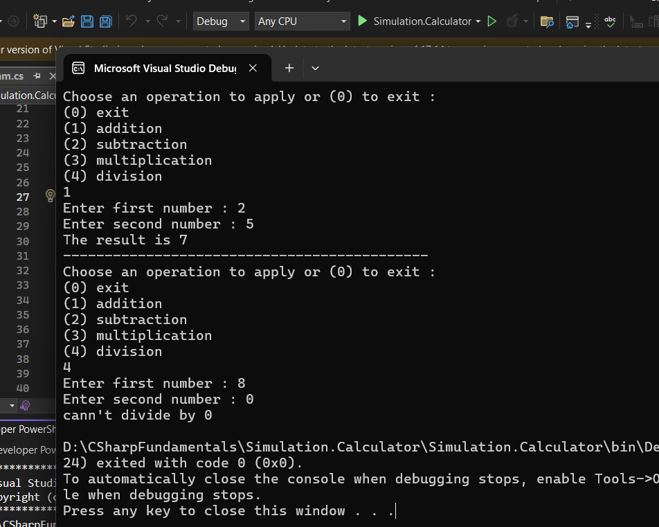

# Simple Calculator

## Project Description

A simple console-based calculator that performs basic arithmetic operations on two numbers.

The calculator supports:

- Addition
- Subtraction
- Multiplication
- Division

## Language Used

- C#

## How to Use

1. Run the program.
2. Choose an operation:
   - `0` → Exit
   - `1` → Addition
   - `2` → Subtraction
   - `3` → Multiplication
   - `4` → Division
3. Enter the first number.
4. Enter the second number.
5. The program displays the result.
6. You can choose another operation or exit the program.

## Screenshot

